# kthGPT <!-- omit in toc -->

kthGPT is a free and open source tool that can watch a lecture for you. As a student, kthGPT can help you learn how to solve assignments and understand lecture slides and other course material.

> This project **is not** affiliated with KTH. It's just a tool that's meant to be useful for KTH students.


# Table of Contents <!-- omit in toc -->

- [Usage](#usage)
  - [Understanding an assignment](#understanding-an-assignment)
    - [1. Select an assignment](#1-select-an-assignment)
    - [2. kthGPT will parse the assignment](#2-kthgpt-will-parse-the-assignment)
    - [3. Ask questions and find relevant lectures](#3-ask-questions-and-find-relevant-lectures)
      - [Detailed step-by-step instructions](#detailed-step-by-step-instructions)
      - [Explaining exam solutions](#explaining-exam-solutions)
      - [Asking questions about notation](#asking-questions-about-notation)
  - [Watching lectures](#watching-lectures)
    - [1. Select lecture](#1-select-lecture)
    - [2. Wait for kthGPT to "watch" the lecture](#2-wait-for-kthgpt-to-watch-the-lecture)
    - [3. Ask questions about the lecture](#3-ask-questions-about-the-lecture)
- [Run the tool locally](#run-the-tool-locally)
  - [Docker](#docker)
  - [Development](#development)
- [Testsuite](#testsuite)
- [Screenshots](#screenshots)
- [License](#license)

## Usage

kthGPT is available at [https://kthgpt.com](https://kthgpt.com) - it's free to use!

### Understanding an assignment

#### 1. Select an assignment

Take an image of the assignment you want help with. It can be handwritten or a screenshot straight from the exam. Note, kthGPT currently doesn't support PDF uploads.

Make sure the screenshot includes all the necessary information about the assignment. kthGPT can only consider one screenshot at the time.

> **The following is a good example of how to submit an image.**
>
> 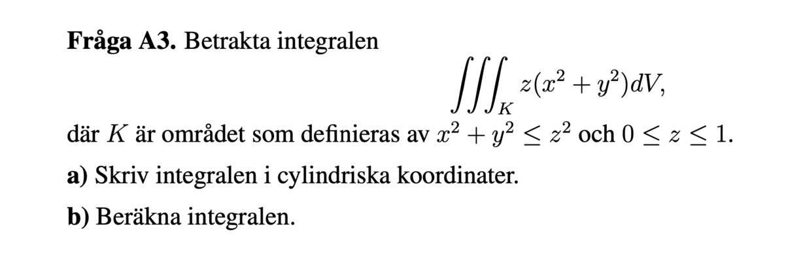

#### 2. kthGPT will parse the assignment

Wait for kthGPT to analyze the assignment. This usually takes between 30-60 seconds.

#### 3. Ask questions and find relevant lectures

The assignment is now ready for questions, ask-away! On the right hand side kthGPT is showing which lectures are relevant to the assignment, and where in the lecture you can learn how to solve the assignment.

Below are some examples of questions you can ask.

##### Detailed step-by-step instructions

Consider this assignment.

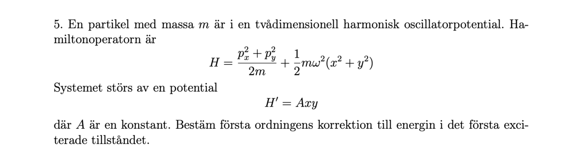

kthGPT produced the following response to this question.

> Question: **_Give me detailed step-by-step instructions of how to solve this assignment_**
>
> Response
> 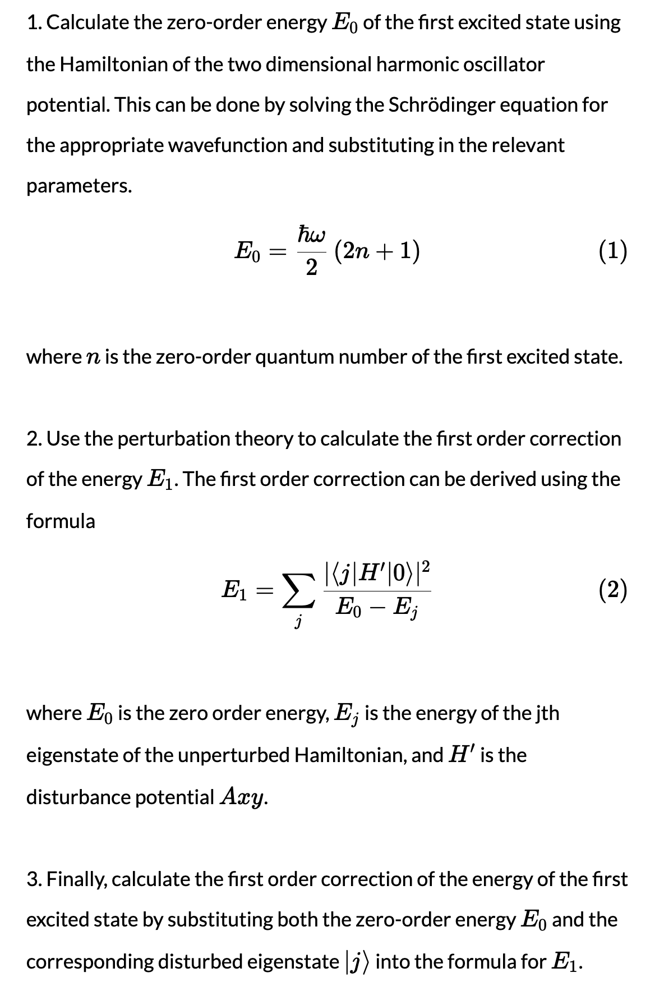

##### Explaining exam solutions

Consider this image of an assignment and its solution

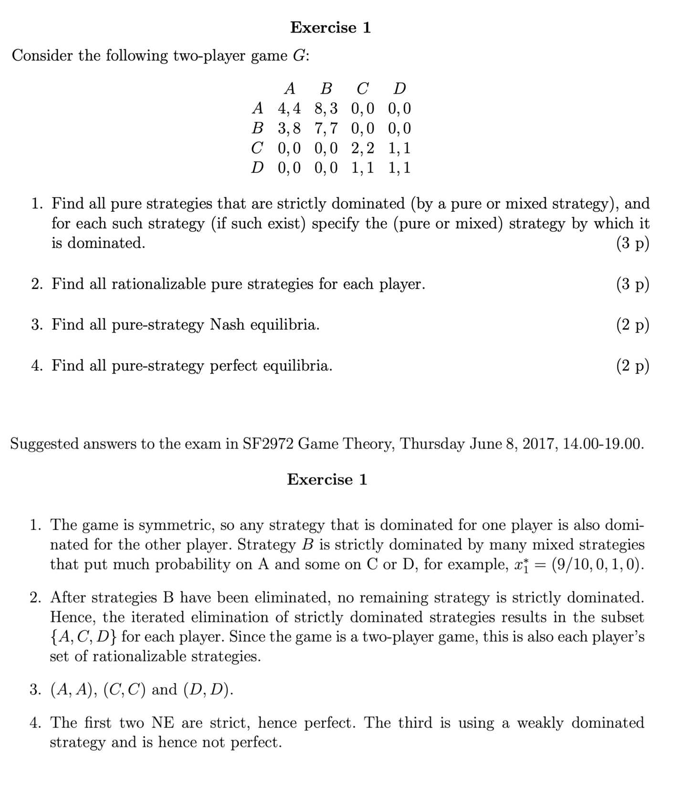

kthGPT produced the following response to this question.

> Question: **_Consider this solution to an assignment, explain how the solution works in detail. Include step by step instructions_**
>
> The assignment is to analyze and solve a two-player game with a payoff matrix. The first step is to find all strategies that are strictly dominated. This means that for a given strategy, there is another strategy which gives a higher payoff regardless of the opponent's move. To do this, we can use the iterated elimination of strictly dominated strategies. This involves looking at all the strategies and seeing if any of them can be eliminated, i.e. if there is another strategy which always yields a higher payoff. In this case, strategy B is strictly dominated, as strategy A gives an equally high payoff in the first row of the matrix, and it also gives a higher payoff in the second row.
>
> The next step is to find all rationalizable strategies for each player. This involves looking at the remaining strategies and seeing if any can be eliminated, as they are not considered 'rational'. For example, if one strategy yields a 0 payoff no matter what the opponent does, then it might not be considered rational. In this case, none of the remaining strategies are strictly dominated, so the subset consisting of strategies A, C, and D is the set of rational strategies for both players.
>
> The third step is to find all the pure-strategy Nash equilibria. This means finding all the strategies where both players playing best response strategies will get the same payoff. In this case, the strategies A, C, and D all meet this criteria and hence can be considered Nash equilibria.
>
>Finally, the fourth step is to find all pure-strategy perfect equilibria. This is similar to Nash equilibria, but with additional criteria. For a strategy to be considered a perfect equilibrium, both players must be playing Nash strategies and the strategy must not involve a player playing a weakly-dominated strategy. In this case, the strategies A and C are perfect equilibria, as they do not involve weakly-dominated strategies. The strategy D is not a perfect equilibrium, as it involves playing a weakly-dominated strategy.

##### Asking questions about notation

Sometimes it's tricky to put words against what question you have, consider this lecture slide.

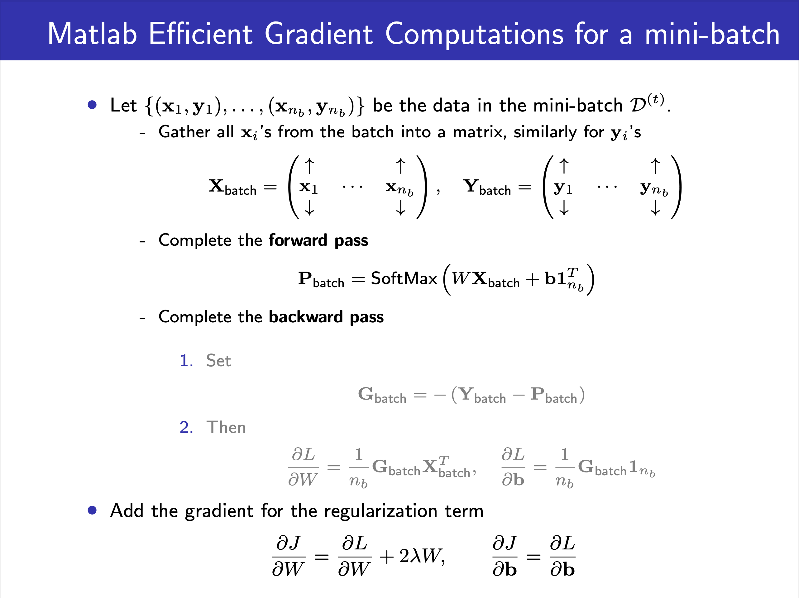

kthGPT produced the following answer to this question.

> **Question: _What does the bolded one mean at the end of the slide? The one at 1_n_b_**
>
> 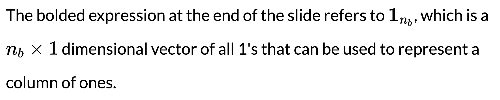

### Watching lectures

#### 1. Select lecture

Select a lecture that's already been watched or add a new one! kthGPT can watch lectures hosted on [KTH Play](https://play.kth.se/) or [YouTube](https://youtube.com).

It can't watch any video on YouTube. Due to limited capacity kthGPT will only watch "relevant videos". Relevant videos are such that it thinks are `Recorded Lectures`. kthGPT uses a sample of the video to do this assessment.

#### 2. Wait for kthGPT to "watch" the lecture

If the video has not been watched by kthGPT before, it will start watching the video and try to produce a summary. It will only listen to the audio, so nothing been shown or written in the lecture will be included in the summary.

This process is very resource intensive and usually takes between 20-60 minutes. This will be slower if many videos have been queued.

If the audio quality in the video is bad, the quality of the summary will be worse. kthGPT is generally best at understanding English. However, if the audio quality is good, Swedish should be just fine as well.

#### 3. Ask questions about the lecture

The lecture is ready. kthGPT can now use GPT-3 to answer questions about the lecture. Some useful queries:

**- Summarize the lecture for me into 10 bullets**
>
> This query obviously useful to get a brief overview about what's covered in the lecture

**- Tell me the core concepts covered in the lecture and give some explanations for each**
>
> This usually produce very good results. Answers seem to be less inclined to summarise the audio transcript and focus more on the topics. Which seem to produce more accurate results.

**- At which point in the lecture is X covered?**
>
> Pretty self explanatory, useful to quickly now where to look in a lecture.

**- Where in the course book "X" can i read more about the topics from this lecture?**
>
> Very useful to find more reading instructions.
>
> In [this lecture](https://kthgpt.com/questions/lectures/0_xkulq3st/en) the following question:
>
> - _Where in the course book "Hans Peters, Game Theory: A Multi-Leveled Approach, Springer 2008" can i read more about the topics from this lecture?_
>
> Produce the following results
> - Hans Peters, Game Theory: A Multi-Leveled Approach, Springer 2008 (Chapter 6) provides a deep exploration of the topics discussed in this lecture. It includes discussion on transferable utility and the core, super-aditivity, and finding efficient outcomes in non-zero sum games, as well as balancing games and linear programming.
>

**- If i didn't attend this lecture what would I have to read-up on?**
>
> Tends to produce quite brief answers, with very "google:able" keywords.

## Run the tool locally

### Docker

The easiest way to run kthGPT locally is using [docker](https://www.docker.com/).

Update the environment.

```bash
cp .env.example .env
```

Make sure to update `OPENAI_API_KEY=sk-xxx...` with an API key from OpenAI [available here](https://platform.openai.com/account/api-keys).


```bash
# If host machine is running ARM (eg. M1 macs)
export DOCKER_DEFAULT_PLATFORM=linux/amd64

# Start the application
docker-compose up

# Download the course list
docker exec -it api sh -c "fetch_kth_courses"
```

The application should now be available on [http://localhost:1337](http://localhost:1337).

### Development

The following commands are useful to get the project setup for local development.

Clone the repo

```bash
git clone https://github.com/nattvara/kthGPT.git
cd kthGPT
```

```bash
python --version
# Python 3.10.8   Tested with this version
python -m venv venv
source venv/bin/activate

# Install dependencies
pip install -r requirements.txt
python setup.py develop
playwright install
playwright install-deps
```

Start the database.

```bash
docker run --name db -p 5432:5432 -e POSTGRES_PASSWORD=postgres -d postgres

psql -h 127.0.0.1 -p 5432 -U postgres -c "CREATE DATABASE kthgpt;" # password: postgres

# Create the database
create_db_schema
```

Start the redis server (used as backend for the job server).

```bash
docker run --name redis -d -p 6379:6379 redis redis-server --requirepass redis
```

Start the OpenSearch index.

```bash
docker run -p 9200:9200 -p 9600:9600 -e "discovery.type=single-node" --name opensearch -d opensearchproject/opensearch:latest
```

Start a queue worker.

```bash
rq worker --with-scheduler --url='redis://:@localhost:6379' default download extract transcribe summarise monitoring approval metadata image image_questions image image_metadata classifications
rq worker --with-scheduler --url='redis://:redis@localhost:6379' gpt # gpt queue must run on at least one separate worker
```

Start the web server.

```bash
uvicorn api:main --reload
```

Start the frontend.

```bash
# make sure pnpm is installed
npm install -g pnpm

cd web-ui
pnpm install

npm run dev
```

## Testsuite

To run the testsuite execute the following command in the repository root.

```bash
$ pytest
===================== test session starts ======================
collected 5 items

tests/feature/api/test_index.py .                        [ 20%]
tests/feature/api/test_lectures.py .                     [ 40%]
tests/feature/jobs/test_download_lecture.py .            [ 60%]
tests/unit/tools/video/test_img.py ..                    [100%]

====================== 5 passed in 0.78s =======================
```

## Screenshots

> ### kthGPT start-page

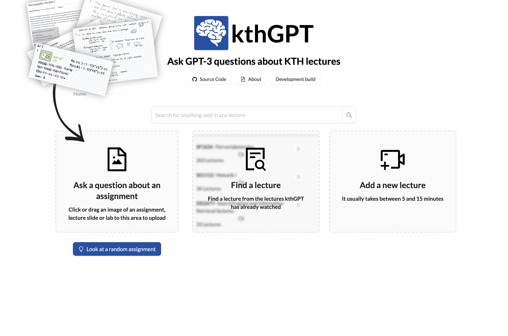

> ### Add lectures from KTH Play or YouTube lecture

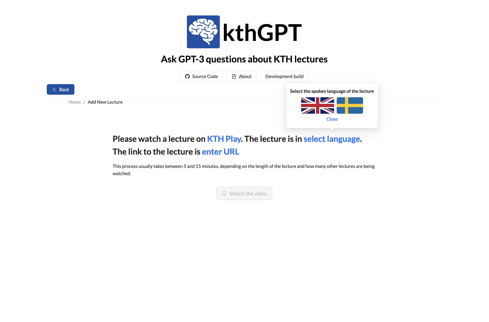

> ### Ask questions about lectures

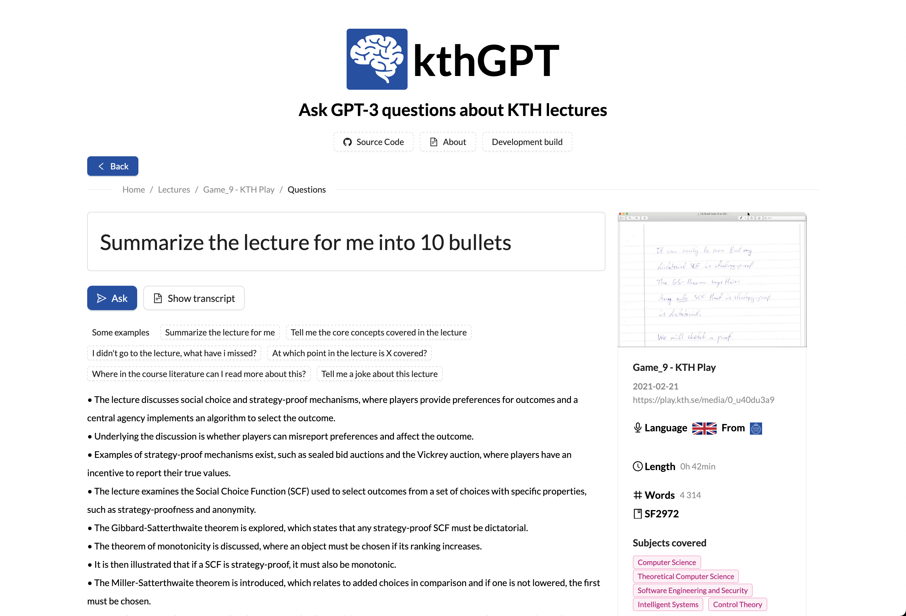

> ### Full transcript search across lectures

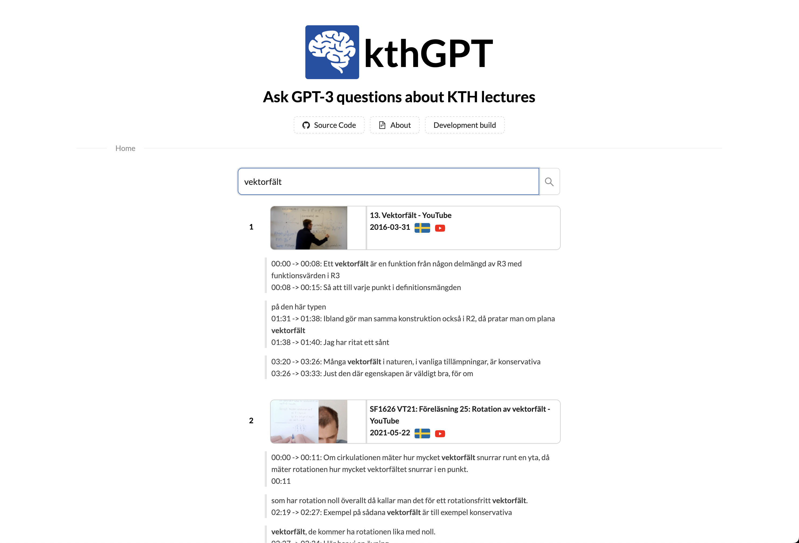

> ### Ask questions about assignments

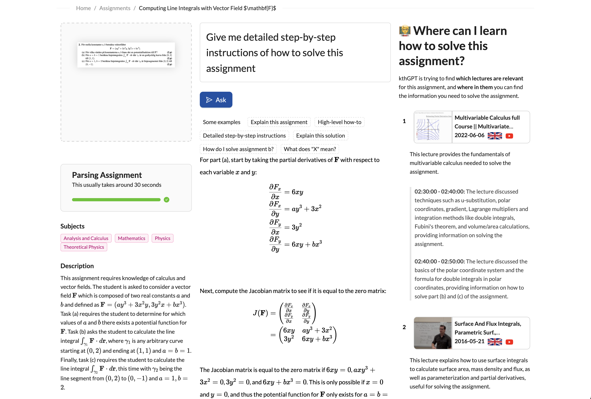

## License

MIT © Ludwig Kristoffersson

See [LICENSE file](LICENSE) for more information.
