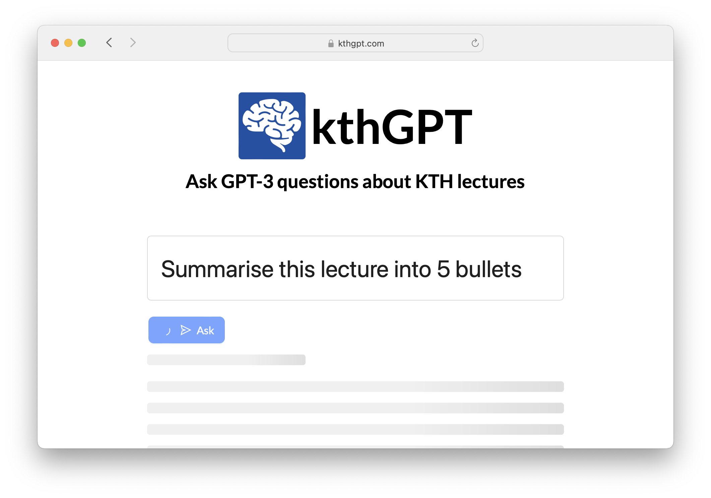

# kthGPT <!-- omit in toc -->

kthGPT is a free and open source tool that can watch a lecture for you. It allows students to ask questions about any lecture using the GPT-3 model.

> This project **is not** affiliated with KTH. It's just a tool that's meant to be useful for KTH students.



# Table of Contents <!-- omit in toc -->

- [Usage](#usage)
  - [Docker](#docker)
  - [Development](#development)
- [Screenshots](#screenshots)
- [License](#license)


## Usage

### Docker

The easiest way to run kthGPT locally is using [docker](https://www.docker.com/).

Update the environment.

```bash
cp .env.example .env
```

Make sure to update `OPENAI_API_KEY=sk-xxx...` with an API key from OpenAI [available here](https://platform.openai.com/account/api-keys).


```bash
# If host machine is running ARM (eg. M1 macs)
export DOCKER_DEFAULT_PLATFORM=linux/amd64

# Start the application
docker-compose up

# Download the course list
docker exec -it api sh -c "fetch_kth_courses"
```

The application should now be available on [http://localhost:1337](http://localhost:1337).

### Development

The following commands are useful to get the project setup for local development.

Clone the repo

```bash
git clone https://github.com/nattvara/kthGPT.git
cd kthGPT
```

```bash
python --version
# Python 3.10.8   Tested with this version
python -m venv venv
source venv/bin/activate

# Install dependencies
pip install -r requirements.txt
python setup.py develop
playwright install
playwright install-deps
```

Start the database.

```bash
docker run --name db -p 5432:5432 -e POSTGRES_PASSWORD=postgres -d postgres

psql -h 127.0.0.1 -p 5432 -U postgres -c "CREATE DATABASE kthgpt;" # password: postgres

# Create the database
create_db_schema
```

Start the redis server (used as backend for the job server).

```bash
docker run --name redis -d -p 6379:6379 redis redis-server --requirepass redis
```

Start the OpenSearch index.

```bash
docker run -p 9200:9200 -p 9600:9600 -e "discovery.type=single-node" --name opensearch -d opensearchproject/opensearch:latest
```

Start a queue worker.

```bash
rq worker --with-scheduler --url='redis://:redis@localhost:6379' default download extract transcribe summarise monitoring approval metadata
rq worker --with-scheduler --url='redis://:redis@localhost:6379' gpt # gpt queue must run on at least one separate worker
```

Start the web server.

```bash
uvicorn api:main --reload
```

Start the frontend.

```bash
# make sure pnpm is installed
npm install -g pnpm

cd web-ui
pnpm install

npm run dev
```

## Screenshots

> Select a KTH Play lecture


> The lecture is analysed


> Ask questions about the lecture


## License

MIT © Ludwig Kristoffersson

See [LICENSE file](LICENSE) for more information.
